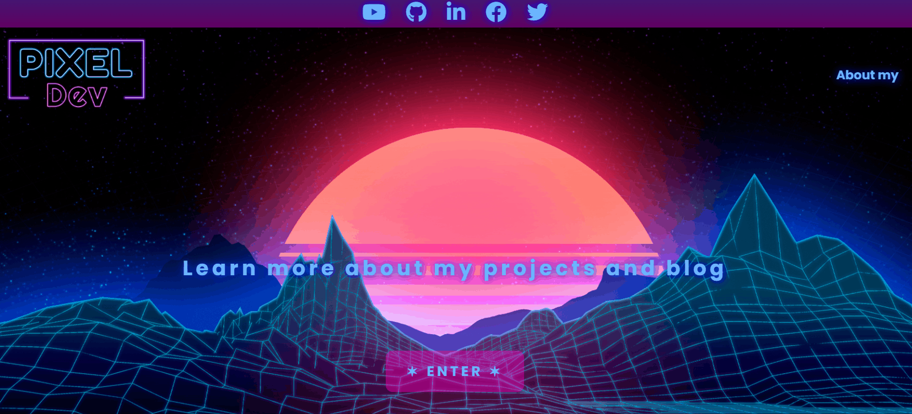

🔰 My personal website.

## 💻Preview

Check out: [PixelDev](https://pixe-l.github.io/Portfolio/)

## 👨‍💻About

I have turned this project into my personal website. The main goal was to have a place to show my work and where people could get to know me better.

I have in mind to continue improving this project as soon as I learn more advanced technologies.

By now I know the vanilla of these technologies (HTML and CSS), currently I'm still learning about JavaScript and React.js.

It gives me satisfaction and pride to be able to finish this project, to continue improving personally and professionally.

I will continually update this portfolio and never stop learning.🍀

## 👽Technologies

- **HTML**
- **CSS**

## 🤲Contributing

You can send me your comments on [Twitter](https://twitter.com/iPiixeeL) or [Facebook](https://www.facebook.com/tutospixel), to continue improving the project.

## 📄License

Copyright © 2022 [Arturo Castañeda](https://github.com/Pixe-L). 
This project is [MIT](./LICENSE.md) licensed.
